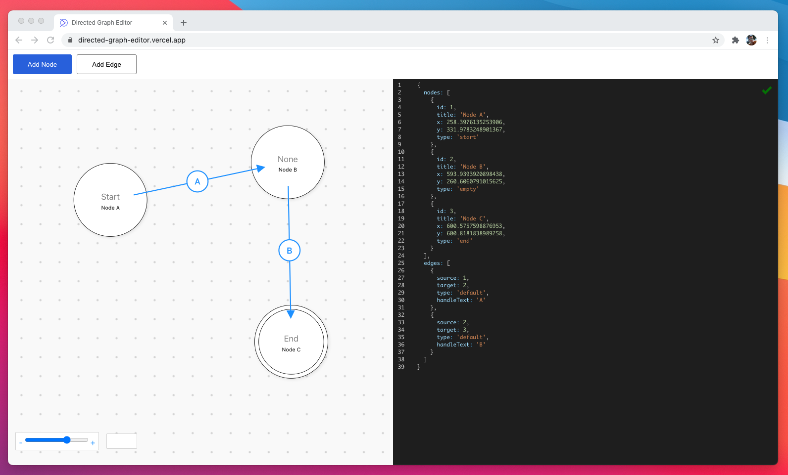

# Directed Graph Editor

)

This is a tool to create directed graphs using a visual editor and a json editor.

View at https://directed-graph-editor.vercel.app/

## Installation

1. Install prerequisites:
   - [Node.js](https://nodejs.org/en/)
2. Clone the repository
3. Run `npm install` to install dependencies
4. Run `npm start` to start the development server.

## How to use

Visit the [demo site](https://directed-graph-editor.vercel.app/) to try it out.

- Move Node
  - Select a node and move it to where you want it
- Delete Node
  - Select a node and press **backspace** or **delete**
- Add Node
  - Hold **shift** and click where you want to create the node.
  - Press the "Add Node" button. New node will be created at the coordinates (0,0).
- Add Edge
  - Hold **shift** and drag the edge from one node to another.
  - OR Press the "Add Edge" button when a Node is selected. It will create an edge from the selected node to the latest added node.
- Change Text / Type
  - Use the JSON Editor to change these properties.

Supported Node Types:

- `start`
- `empty`
- `end`

Changes from the JSON editor will be applied to the ui editor and vice versa.

## Known Issues

- Selecting an Edge is only possible if you click directly on the center of the arrow.

## Contribute

Contributions are welcome.
To do so:

- Fork the repo
- Make your change
- Create a PR into the master of this repo
